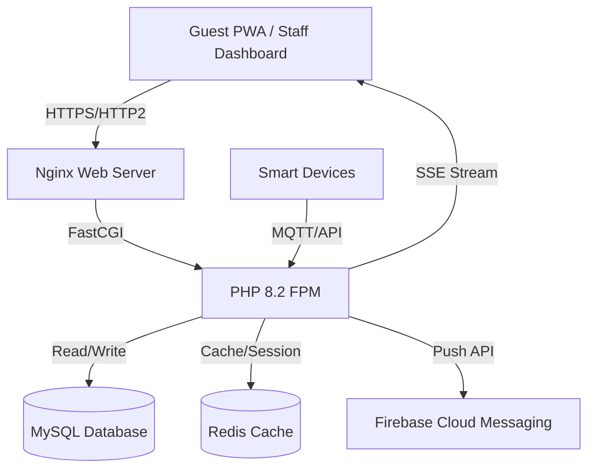

# Hotel Management & Smart Order System

A comprehensive, fast-loading hotel management and order taking system built with **PHP 8.2+**, **CSS4**, and **HTML5**. Features include Super Admin multi-property management, Smart Hotel IoT integration, PWA installation, real-time notifications, and an optimized order management workflow.

---

## 📋 Table of Contents

1. [Project Overview](#project-overview)
2. [Tech Stack](#tech-stack)
3. [System Architecture](#system-architecture)
4. [Directory Structure](#directory-structure)
5. [Database Schema](#database-schema)
6. [Core Features](#core-features)
7. [Performance Optimization (Fast Loading)](#performance-optimization)
8. [PWA Implementation](#pwa-implementation)
9. [Notification System](#notification-system)
10. [Security Measures](#security-measures)
11. [API Endpoints](#api-endpoints)
12. [Deployment Guide](#deployment-guide)
13. [Development Roadmap](#development-roadmap)

---

## 1. Project Overview

This system is designed for hotels, resorts, and restaurant chains to manage operations efficiently. It supports:
- **Multi-tenancy**: Super Admin manages multiple properties.
- **Smart Hotel Integration**: Connects with IoT devices (locks, thermostats, lights).
- **Order Management**: QR code ordering, Kitchen Display System (KDS), and table management.
- **Customer Experience**: Installable PWA for guests to order without app store downloads.
- **Real-time Communication**: Instant notifications for staff and guests.

### Key Roles
| Role | Permissions |
|------|-------------|
| **Super Admin** | Manage all properties, users, global settings, billing, analytics. |
| **Property Admin** | Manage specific hotel/restaurant, menu, staff, rooms, local orders. |
| **Staff** | View assigned tasks, update order status, manage housekeeping. |
| **Kitchen Staff** | View incoming orders, update preparation status (KDS). |
| **Guest** | Browse menu, place orders, request services, install PWA. |

---

## 2. Tech Stack

### Backend
- **Language**: PHP 8.2+ (Strict typing, JIT compiler enabled)
- **Architecture**: MVC (Model-View-Controller) custom lightweight framework
- **Database**: MySQL 8.0 / MariaDB (InnoDB engine)
- **Caching**: Redis (Session storage, Object caching)
- **Queue**: Redis Streams / Database-backed job queue for async tasks
- **Real-time**: Server-Sent Events (SSE) for live updates (Lightweight alternative to WebSockets)

### Frontend
- **Markup**: HTML5 (Semantic)
- **Styling**: CSS4 (Native variables, Container Queries, `:has()`, Subgrid, Color Mix)
- **JavaScript**: Vanilla ES6+ (No heavy frameworks for speed)
- **PWA**: Service Workers, Manifest.json, Background Sync

### Server & DevOps
- **Web Server**: Nginx (HTTP/2, Brotli compression)
- **PHP Handler**: PHP-FPM with OPcache
- **OS**: Linux (Ubuntu 22.04 LTS)
- **SSL**: Let's Encrypt

---

## 3. System Architecture



---

## 4. Directory Structure

```text
/hotel-system
├── /public                  # Document Root
│   ├── index.php            # Entry Point
│   ├── manifest.json        # PWA Manifest
│   ├── sw.js                # Service Worker
│   ├── assets
│   │   ├── css              # Compiled CSS4
│   │   ├── js               # Minified JS
│   │   └── images           # WebP/AVIF optimized
│   └── .htaccess            # Apache fallback (if used)
├── /app
│   ├── /Config              # DB, Redis, App settings
│   ├── /Controllers         # Logic handlers
│   │   ├── AuthController.php
│   │   ├── OrderController.php
│   │   ├── AdminController.php
│   │   └── NotificationController.php
│   ├── /Models              # Database interactions
│   ├── /Views               # PHP Templates
│   │   ├── layouts          # Header, Footer, Sidebar
│   │   ├── admin            # Admin dashboards
│   │   ├── staff            # Staff views
│   │   └── guest            # PWA ordering views
│   └── /Core                # Framework Core (Router, DB, Auth)
├── /storage
│   ├── /logs                # App logs
│   ├── /cache               # File cache
│   └── /uploads             # User uploads (menus, avatars)
├── /routes                  # Route definitions
├── /vendor                  # Composer dependencies (if any)
└── /scripts                 # CLI scripts (Cron jobs)
```

---

## 5. Database Schema

### Users & Roles
```sql
CREATE TABLE users (
    id INT UNSIGNED AUTO_INCREMENT PRIMARY KEY,
    property_id INT UNSIGNED NULL, -- Null for Super Admin
    name VARCHAR(100),
    email VARCHAR(100) UNIQUE,
    password_hash VARCHAR(255),
    role ENUM('super_admin', 'admin', 'staff', 'kitchen', 'guest') NOT NULL,
    phone VARCHAR(20),
    is_active TINYINT(1) DEFAULT 1,
    created_at TIMESTAMP DEFAULT CURRENT_TIMESTAMP
);
```

### Properties (Hotels)
```sql
CREATE TABLE properties (
    id INT UNSIGNED AUTO_INCREMENT PRIMARY KEY,
    name VARCHAR(150),
    address TEXT,
    config_json JSON, -- Smart device configs
    is_active TINYINT(1) DEFAULT 1
);
```

### Orders
```sql
CREATE TABLE orders (
    id INT UNSIGNED AUTO_INCREMENT PRIMARY KEY,
    property_id INT UNSIGNED,
    user_id INT UNSIGNED, -- Guest or Staff
    table_number VARCHAR(10),
    room_number VARCHAR(10),
    status ENUM('pending', 'confirmed', 'preparing', 'ready', 'delivered', 'cancelled'),
    total_amount DECIMAL(10,2),
    payment_status ENUM('unpaid', 'paid', 'refunded'),
    created_at TIMESTAMP DEFAULT CURRENT_TIMESTAMP,
    INDEX idx_status (status),
    INDEX idx_property (property_id)
);
```

### Notifications
```sql
CREATE TABLE notifications (
    id INT UNSIGNED AUTO_INCREMENT PRIMARY KEY,
    user_id INT UNSIGNED,
    title VARCHAR(100),
    message TEXT,
    type ENUM('order', 'alert', 'info', 'system'),
    is_read TINYINT(1) DEFAULT 0,
    created_at TIMESTAMP DEFAULT CURRENT_TIMESTAMP
);
```

---

## 6. Core Features

### A. Super Admin System
- **Dashboard**: Global revenue, active properties, user count.
- **Property Management**: Add/Edit/Delete hotels.
- **User Management**: Create admins for specific properties.
- **Subscription/Billing**: Manage plans for properties.

### B. Property Admin System
- **Menu Management**: Categories, items, modifiers, pricing, images.
- **Room/Table Setup**: Define floor plans.
- **Staff Management**: Assign roles, shift scheduling.
- **Reports**: Sales reports, popular items, peak hours.

### C. Smart Hotel System
- **IoT Dashboard**: Control lights/AC in rooms (via API integration).
- **Service Requests**: Housekeeping, maintenance requests linked to room numbers.
- **Check-in/out**: Digital registration via PWA.

### D. Order Taking & Management
- **QR Code Generation**: Unique QR per table/room linking to PWA.
- **Guest PWA**:
  - Browse menu with high-res images.
  - Add to cart, special instructions.
  - Pay via integrated gateway or "Pay at Counter".
  - Track order status in real-time.
- **Kitchen Display System (KDS)**:
  - Auto-refreshing screen for new orders.
  - Color-coded timers (Green: New, Yellow: Waiting, Red: Delayed).
  - One-click status updates.

---

## 7. Performance Optimization (Fast Loading)

To ensure < 1s load times:

### PHP Optimizations
- **OPcache**: Enabled with aggressive settings.
  ```ini
  opcache.enable=1
  opcache.memory_consumption=256
  opcache.max_accelerated_files=20000
  opcache.validate_timestamps=0 ; In production
  ```
- **Preloading**: Compile frequently used classes into memory.
- **Database**: Use prepared statements, indexed columns, and avoid N+1 queries.

### CSS4 Features
- **Container Queries**: Responsive components based on parent size, not just viewport.
  ```css
  .card-container {
      container-type: inline-size;
  }
  @container (min-width: 400px) {
      .card { display: flex; }
  }
  ```
- **`:has()` Selector**: Style parents based on children (no JS needed).
  ```css
  .form-group:has(input:invalid) { border-color: red; }
  ```
- **Color Mix**: Dynamic theming.
  ```css
  .highlight { background-color: color-mix(in srgb, var(--primary), white 20%); }
  ```
- **Subgrid**: Perfect alignment in nested grids.

### Asset Optimization
- **Critical CSS**: Inline above-the-fold CSS directly in HTML `<head>`.
- **Lazy Loading**: `loading="lazy"` for images below fold.
- **Modern Formats**: Serve WebP/AVIF with fallbacks.
- **HTTP/2 Push**: Preload critical assets via Nginx config.

### Caching Strategy
- **Page Cache**: Static HTML for guest menu pages (bypass PHP).
- **Object Cache**: Redis for DB query results and session data.
- **Browser Cache**: Aggressive `Cache-Control` headers for static assets.

---

## 8. PWA Implementation

### manifest.json
```json
{
  "name": "Smart Hotel Order",
  "short_name": "HotelOrder",
  "start_url": "/guest/home",
  "display": "standalone",
  "background_color": "#ffffff",
  "theme_color": "#4F46E5",
  "icons": [
    { "src": "/assets/icons/icon-192.png", "sizes": "192x192", "type": "image/png" },
    { "src": "/assets/icons/icon-512.png", "sizes": "512x512", "type": "image/png" }
  ]
}
```

### Service Worker (sw.js)
- **Offline Mode**: Cache shell (HTML/CSS/JS) and recent menu data.
- **Background Sync**: Queue orders if internet is lost; send when reconnected.
- **Push Notifications**: Listen for server push events.

### Install Prompt
- Detect installability using `beforeinstallprompt` event.
- Show a custom native-like banner inviting the user to "Install App".

---

## 9. Notification System

### Architecture
1. **Server-Sent Events (SSE)**:
   - Persistent HTTP connection from client to server.
   - Server pushes JSON updates (new order, status change) instantly.
   - Lightweight, works over standard HTTP/2.
   
2. **Push API (for background)**:
   - Used when the PWA is closed.
   - Integrates with Firebase Cloud Messaging (FCM) or VAPID.

### Implementation Flow
1. **Trigger**: Kitchen marks order as "Ready".
2. **Backend**: Updates DB -> Writes to Redis Pub/Sub.
3. **Dispatcher**: PHP script reads Redis -> Sends SSE to connected Waiter/Guest.
4. **Client**: JS EventSource receives update -> Toast notification + Sound alert.

---

## 10. Security Measures

- **Authentication**:
  - Secure password hashing (`password_hash` with ARGON2ID).
  - Session regeneration on login.
  - HTTPOnly and Secure cookies.
- **CSRF Protection**: Token validation on all POST/PUT/DELETE requests.
- **XSS Prevention**: Output escaping (`htmlspecialchars`) on all views.
- **SQL Injection**: Strict use of PDO Prepared Statements.
- **Rate Limiting**: Throttle login attempts and API calls via Redis.
- **Input Validation**: Strict typing and validation libraries.

---

## 11. API Endpoints (RESTful)

| Method | Endpoint | Description | Access |
|--------|----------|-------------|--------|
| `POST` | `/api/auth/login` | User login | Public |
| `GET`  | `/api/menu` | Get active menu | Public/Guest |
| `POST` | `/api/orders` | Place new order | Guest/Staff |
| `GET`  | `/api/orders/stream` | SSE endpoint for live updates | Auth |
| `PUT`  | `/api/orders/{id}/status` | Update order status | Staff/Kitchen |
| `GET`  | `/api/admin/stats` | Dashboard statistics | Admin |
| `POST` | `/api/notify/test` | Send test notification | Super Admin |

---

## 12. Deployment Guide

### Prerequisites
- Ubuntu 22.04 Server
- Domain name with DNS configured

### Step 1: Install Stack
```bash
sudo apt update
sudo apt install nginx mysql-server php8.2-fpm php8.2-mysql php8.2-redis php8.2-gd php8.2-curl redis-server -y
```

### Step 2: Configure Nginx
```nginx
server {
    listen 443 ssl http2;
    server_name your-hotel.com;
    root /var/www/hotel-system/public;
    index index.php;

    # SSL Config (Let's Encrypt)
    ssl_certificate /etc/letsencrypt/live/your-hotel.com/fullchain.pem;
    ssl_certificate_key /etc/letsencrypt/live/your-hotel.com/privkey.pem;

    # Gzip/Brotli
    gzip on;
    brotli on;

    location / {
        try_files $uri $uri/ /index.php?$query_string;
    }

    location ~ \.php$ {
        include snippets/fastcgi-php.conf;
        fastcgi_pass unix:/run/php/php8.2-fpm.sock;
        fastcgi_param SCRIPT_FILENAME $realpath_root$fastcgi_script_name;
        include fastcgi_params;
    }

    # Cache Static Assets
    location ~* \.(css|js|jpg|jpeg|png|webp|avif|ico)$ {
        expires 1y;
        add_header Cache-Control "public, immutable";
    }
}
```

### Step 3: Database Setup
```bash
mysql -u root -p
CREATE DATABASE hotel_db CHARACTER SET utf8mb4 COLLATE utf8mb4_unicode_ci;
# Import schema.sql
```

### Step 4: Permissions
```bash
chown -R www-data:www-data /var/www/hotel-system
chmod -R 755 /var/www/hotel-system
chmod -R 775 /var/www/hotel-system/storage
```

---

## 13. Development Roadmap

### Phase 1: Foundation (Weeks 1-2)
- Setup Server Environment (Nginx, PHP, MySQL).
- Implement Core MVC Framework.
- Database Schema Design & Migration.
- Authentication System (Login/Register/Roles).

### Phase 2: Admin & Management (Weeks 3-5)
- Super Admin Dashboard.
- Property Admin Panel (Menu, Rooms, Staff).
- Basic Reporting.

### Phase 3: Ordering System (Weeks 6-8)
- Guest PWA Interface (Menu, Cart, Checkout).
- Order Processing Logic.
- Kitchen Display System (KDS).
- QR Code Generation.

### Phase 4: Real-time & PWA (Weeks 9-10)
- Implement SSE Notification System.
- Service Worker & Offline capabilities.
- Push Notifications setup.
- Install Prompt logic.

### Phase 5: Optimization & Testing (Weeks 11-12)
- CSS4 Refactoring.
- Load Testing & Caching Tuning.
- Security Audit.
- Final Deployment & Training.

---

## Conclusion

This plan delivers a **high-performance, scalable, and modern** hotel management system. By leveraging **PHP 8.2** and **CSS4**, we ensure the application is incredibly fast without the bloat of heavy JavaScript frameworks. The **PWA** approach guarantees a seamless mobile experience for guests, while the **Super Admin** architecture allows for unlimited business growth.
